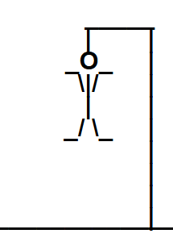
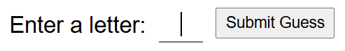

# Hangman
A simple game of hangman from a simple little man

## Background
I'm currently taking a web development bootcamp and about two months in. I got bored and decided to build a hangman game for practice and to pass the time. So far, we've gone over some beginner-level HTML, CSS, Javascript, TypeScript, and jQuery. I plan to add more features and complexity the more I learn. I might just overkill on the complexity for the purpose of increasing my proficiency.

## Under the Hood
For this project, in it's initial stages, I've utilized:
- HTML5
- CSS
- jQuery

Like with most web applications, HTML was used as for the underlying structure, CSS added some flare (if you can consider it so), and jQuery handled the user interactions and "animation."

## How to Install (For Beginners Like Me)
1. Clone the repository
2. Open the HTML file in your local directory

Yeah. That's it. Sometimes people need the simple answers spelled out (I know I did in the beginning). Though I might use TypeScript later on down the road.

## How to Use
- Type a single letter into the prompt.
- Click the button to submit your guess.
- You're allowed 7 incorrect guesses before it's Game Over (Objective Unachieved, whomp whomp, etc.).
- Regardless of the outcome, you will be prompted to either play again, or rage quit.

### Notable Features (only I might find them significant)
- The hangman is a stick figure using characters from the English QWERTY keyboard. Okay. So, about 75% of the way through, as I started thinking about how I should try to modify my program in the near future. I then thought about how I might spruce up the animation and add images. I realized, no... So, this hangman game might turn into a complete-the-picture-of-this-cute-puppy-that's-not-hanging-by-a-noose-by-solving-the-word game.

  

Yeah, even that might be controversial. Oh well. Moving on.

- After submitting the first letter, the prompt will reset, immediately prepared for the next letter submission. This was key to me because it annoyed me like no other when I had to keep moving the cursor back to the input box after every button click.

  

Seriously, that cursor line felt like my messiah when I implemented it. I don't know. Maybe it's just me. I'll get over it. Whatever. Stop looking at me.

## References
- [**MDN Web Docs**](https://developer.mozilla.org/en-US/)
- [**W3Schools**](https://www.w3schools.com/)
